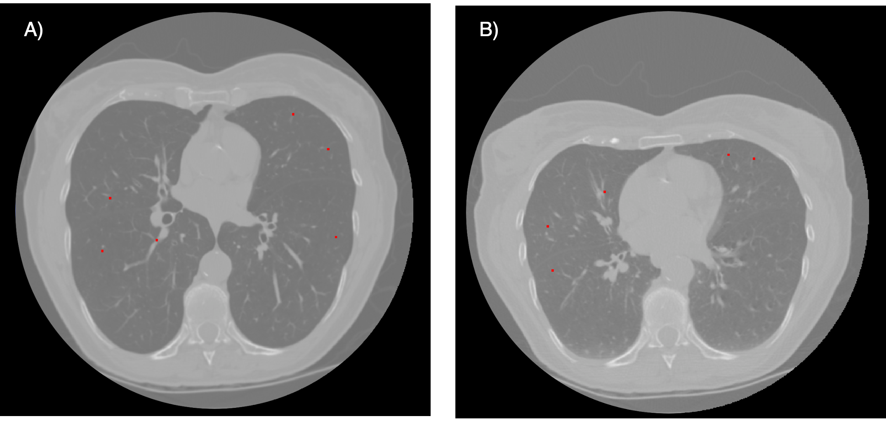
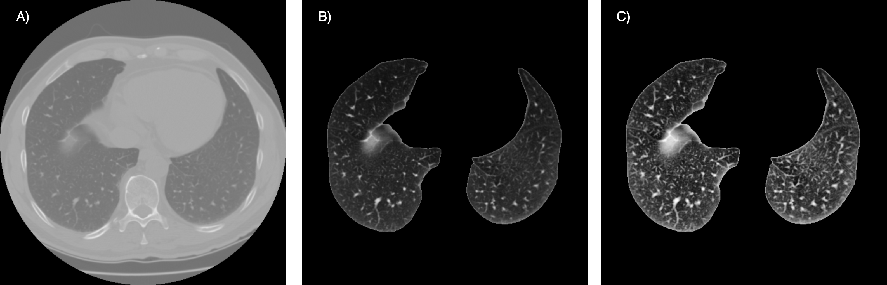

# Image registration of chest CT volumes: 4DCT DIR-Lab Challenge
Authors: Xavier Beltran Urbano and [Frederik Hartmann](https://github.com/Frederik-Hartmann)

## Dataset

To implement this project we have utilized a data set consisting of 4 thoracic 4DCT images acquired at the University of Texas M. D. Anderson Cancer Center in Houston TX. Each CT image in the dataset corresponds to different respiratory-binned phases ranging from T00 to T90. The T00 phase represented end-inhalation while the T50 phase represented end-exhalation. Expert manual annotation was conducted to identify 300 landmarks on each patient’s CT images of T00 and T50. In the Figure 1 we can observe an example of the inhalation and exhalation phases of patient 1 with their corresponding landmarks.

 
<em>Fig. 1. An illustration of the respiratory phases in the COPD1 case. A) Inhalation phase with highlighted landmarks (red points). B) Exhalation phase, also
featuring corresponding landmarks (red points).</em>

## Methodology
Our approach can be divided into 2 sections:
### · Preprocessing

Three preprocessing techniques have been employed and tested (see Fig. 2):

1. **Segmentation:** Two approaches were tested. The first approach relied on classical image processing techniques, focusing on the intensity range and position of the lung. It involved coarse segmentation to remove the table, contour tracking for refinement, and post-processing to close holes. The second approach used a pretrained UNet model, trained on various datasets for lung segmentation.
   
2. **Normalization:** After segmentation, min-max normalization was applied using the formula:

   
3. **Histogram Equalization:** Contrast-limited adaptive histogram equalization (CLAHE) was applied to each axial slice.

 
<em>Fig. 2. Sequential overview of preprocessing steps in this approach. A) Original image B) Segmented Image C) Normalized and contrast-enhanced (CLAHE)
image.</em>

### · Training

1. **Registration-Elastix:** This method included an affine transformation and a bspline registration for non-rigid transformations. A custom parameter set adapted for the challenge was used.

2. **Registration-VoxelMorph:** A deep learning approach using a U-Net architecture, the 'VxmDense' model in TensorFlow, was implemented. The model was trained over 100 epochs, combining Mean Squared Error (MSE) and a gradient loss in the loss function.

## Results

Both quantitative and qualitative results are presented in this section.

### · Quantitative Results

| Parameter File | Affine | Bspline | Segmentation | CLAHE | Time (min) | COPD1 | COPD2 | COPD3 | COPD4 | Mean | Std |
|----------------|:------:|:-------:|:------------:|:-----:|------------|-------|-------|-------|-------|------|-----|
| No Registration | - | - | - | ✓ | 0:36 | - | 26.33 | 21.79 | 12.64 | 29.58 | 22.59 | 6.38 |
| Par11 | ✓ | - | - | - | 0:34 ± 0:04 | 25.98 | 26.26 | 7.50 | 25.75 | 21.38 | 8.01 |
| Par11 | ✓ | ✓ | - | - | 0:51 ± 0:11 | 25.37 | 26.03 | 7.56 | 23.02 | 20.50 | 7.55 |
| Par11 | ✓ | ✓ | ✓ | - | 0:40 ± 0:15 | 15.12 | 14.68 | 5.63 | 12.90 | 12.08 | 3.82 |
| Par11 | ✓ | ✓ | ✓ | ✓ | 10:07 ± 3:24 | 14.16 | 12.84 | 4.87 | 10.16 | 10.51 | 3.56 |
| Par11 | ✓ | ✓¹ | - | ✓ | 23:43 ± 5:58 | 6.88 | 6.73 | 1.90 | 10.91 | 6.60 | 3.19 |
| Par11 | ✓ | ✓² | ✓ | ✓ | - | 8.11 | 7.75 | 2.36 | 10.07 | 7.07 | 2.86 |
| custom | ✓ | - | ✓ | - | 1:25 ± 0:24 | 14.17 | 12.88 | 4.79 | 10.18 | 10.50 | 3.60 |
| custom | ✓ | ✓ | ✓ | - | 4:39 ± 0:33 | 2.39 | 5.60 | 1.95 | 3.71 | 3.41 | 1.42 |
| custom | ✓ | ✓ | ✓ | ✓ | 4:57 ± 0:48 | 1.39 | 4.86 | 1.34 | 2.63 | 2.55 | 1.43 |
| Voxelmorph | - | - | ✓ | ✓ | 46:37 ± 5:12 | 39.76 | 11.28 | 31.50 | 33.12 | 28.92 | 10.53 |

<em>Table 1: Results of the registration comparing different approaches. ¹: Bspline file 1 and 2; ²: Bspline file 1</em>

 

### · Qualitative Results

The image below showcases the outcomes of the final registration for each method employed in this project, providing a visual comparison of their performance:

 
<em>Fig. 3. Fig. 5. Example of the registration obtained with the different approaches implemented in this project. A) Moving Image B) Fixed Image C) Affine +
Normalization + CLAHE, D) Only Affine, E) Affine + Segmentation + Normalization + CLAHE, F) Affine + Segmentation , G) Affine + Bspline set 1 +
Bspline set 2 + Segmentation + Normalization + CLAHE, H) Affine + Bspline set 1 + Segmentation + Normalization + CLAHE, I) Custom parameter set
affine only, J) Custom parameter set affine + Bspline + Segmentation, K) Custom parameter set affine + Segmentation, L) Voxelmorph .</em>

## Conclusion

In conclusion, the variety of methods tested led to several findings:

1. Classical approaches can still outperform deep learning methods if fine-tuned properly.
2. Normalization and contrast enhancement did not lead to improved results but rather worse ones.
3. Segmentation improved results significantly by targeting registration only at relevant regions.
4. The parameter set choice was crucial, with improvements observed when adapting it for the dataset's specific requirements.
